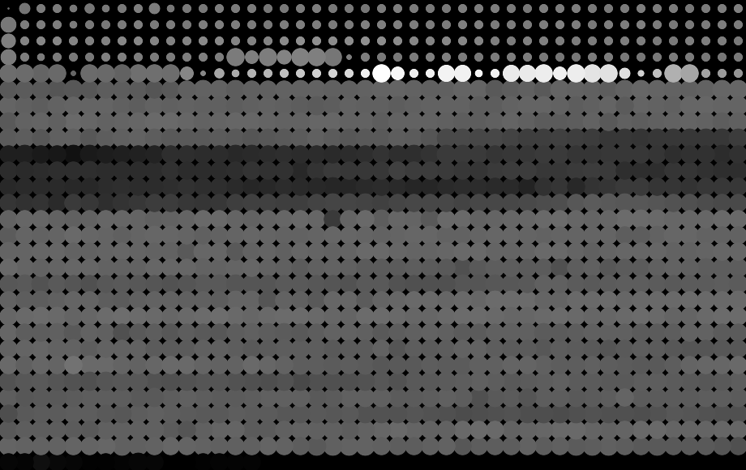
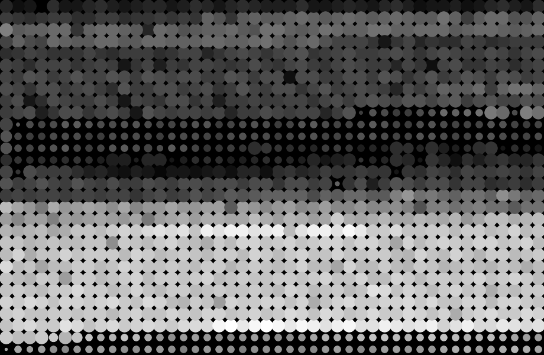
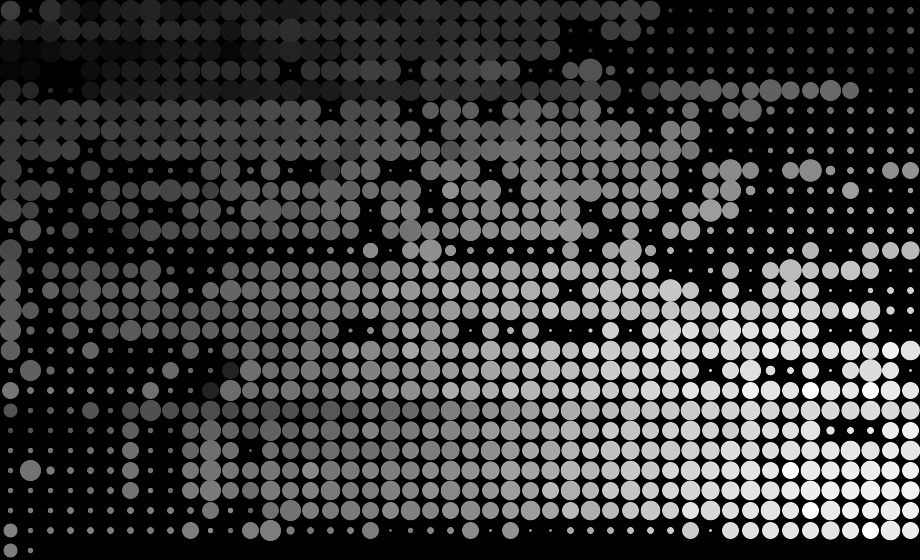
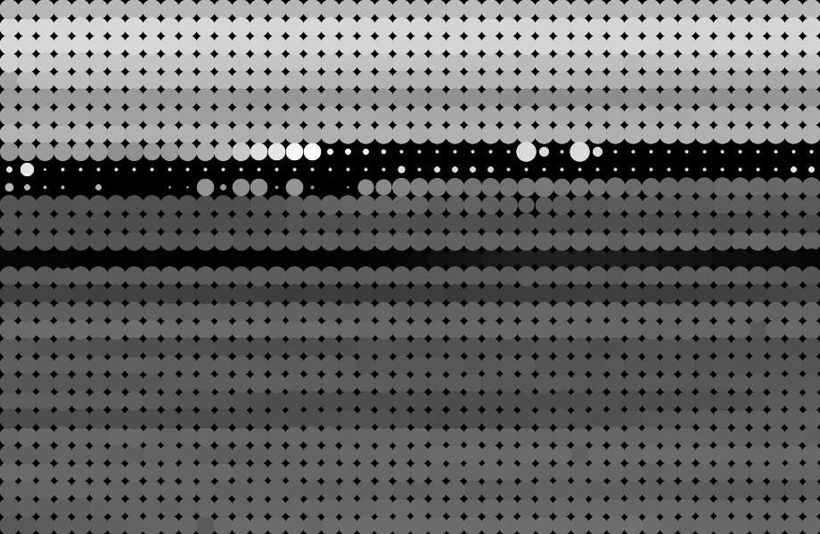
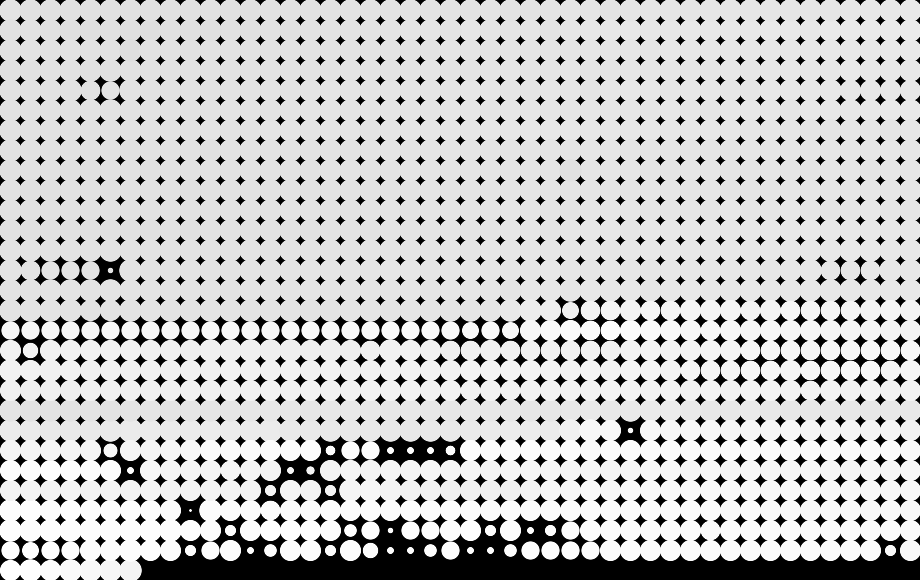
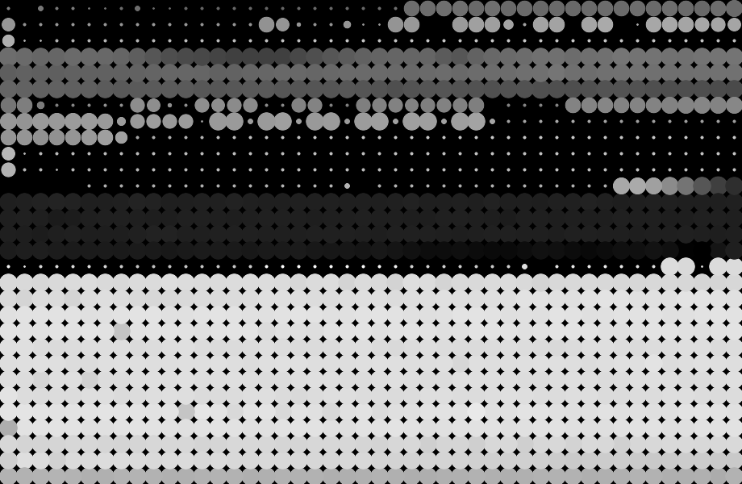
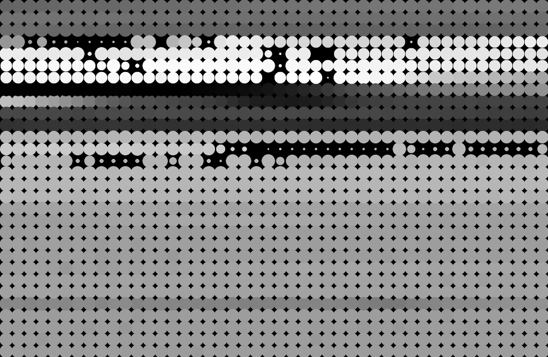

# Jesse's new apartment

This program is an art sketch.

It generates images from data I collected with my friend Jesse at his new apartment.

We collected the data with light sensor, ultrasonic distance sensor, 2 servos, and an Arduino device.

We connected the sensors to the Arduino device, and rigged up the servos to control where the sensors pointed.

The goal was to scan parts of Jesse's new aparment in a grid pattern, and collect measurements of the light and distance at each x, y coordinate.

The data was sent to my computer via Serial port 9600 and recorded in a (semi) csv form with Processing.

That data was then trimmed and converted to json using mrdataconverter.com and a bit of manual adjusting.

Later, I wrote the draw-blips program to visualize the data we collected.

It can be run using node.js:
`node draw-blips.js data/<inputfile>.json <outputfile>.png`

Note: This program depends on GraphicsMagick tool, and gm node module.

Examples:

